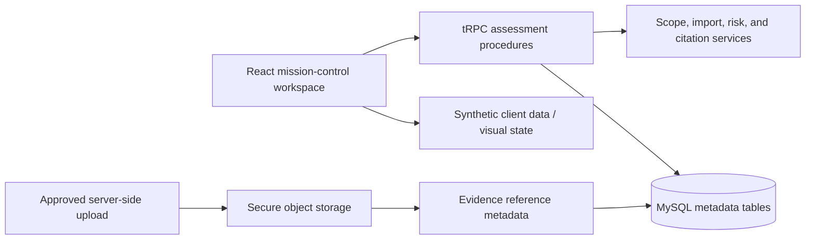

# Architecture Notes

## System boundary

Aegis Atlas uses a deliberate separation between visualization, security-domain reasoning, durable metadata, and file storage. This makes the user interface fast, preserves evidence provenance, and prevents large or sensitive evidence bytes from bloating the workspace database.

## Client application

The client renders the mission-control workspace, map canvas, relationship graph, findings, evidence context, import state, reports, and analyst assistant. The current demonstration uses an in-memory synthetic dataset for an immediately reviewable public experience. It also calls typed server procedures for safety boundary, import preview, and citation-backed assistant drafts.

The map is custom-rendered as a synthetic cartographic canvas so no third-party map account, map token, or real geographic target data is needed. The canvas still communicates key GIS concepts: layers, selected features, confidence radius, connections, coordinate grid, geographic concentration, map controls, and map-to-graph synchronization.

## Server procedures

`server/assessment.ts` provides pure, testable domain rules. The risk service exposes factor contributions rather than hiding prioritization behind a single score. The scope service checks allowed and excluded fragments. The import-preview service extracts simple candidate subjects from supported fixture formats, hashes artifacts, and returns an accepted versus quarantined result. The assistant service returns citations and a mandatory confirmation flag.

`server/routers.ts` exposes these functions through typed tRPC procedures. The demo endpoints are deliberately read-only or preview-only; committing assessment records requires an authenticated, engagement-bound write workflow.

## Persistent metadata model

| Table | Purpose |
| --- | --- |
| `engagements` | Authorization state, safety posture, declared scope, ownership, and lifecycle |
| `assessmentAssets` | Asset identity, type, confidence, geometry metadata, provenance, raw reference, and observation time |
| `assessmentFindings` | Finding severity, confidence, risk factors, remediation, ownership, state, and retest status |
| `evidenceArtifacts` | Object-storage reference metadata only; no file bytes |
| `assessmentAuditEvents` | Human and system actions relevant to traceability |
| `savedAtlasViews` | Reproducible map and filter state for an engagement and user |

The initial migration creates these metadata tables without destructive changes. Foreign-key enforcement and organization/tenant boundaries should be added when the project is adapted from public demo to private deployment.

## Object storage pattern

`server/evidenceStorage.ts` calls the project storage helper and returns `storageKey`, `storageUrl`, filename, MIME type, size, SHA-256 digest, classification, and source metadata. A future authenticated upload route should insert this returned metadata into `evidenceArtifacts`; it must never store file bytes in a database column.

## Trust model

The model distinguishes verified and inferred information. Confidence, provenance, raw reference, source timestamp, and relationship state are designed to flow through assets, findings, imports, map visualization, and reports. This avoids visually overstating IP geolocation, provider relationships, or automated inferences.
